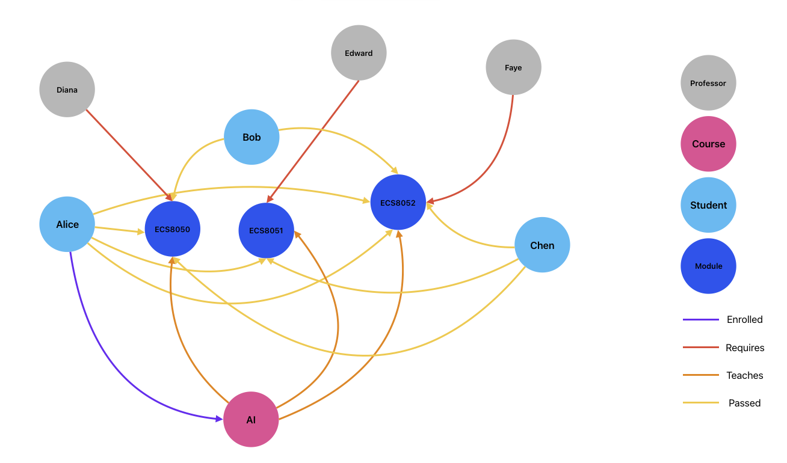
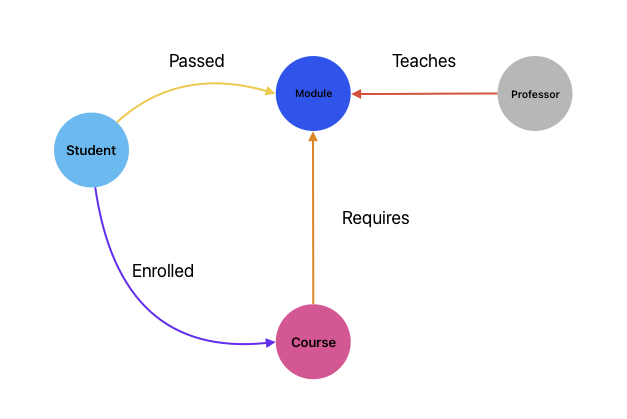
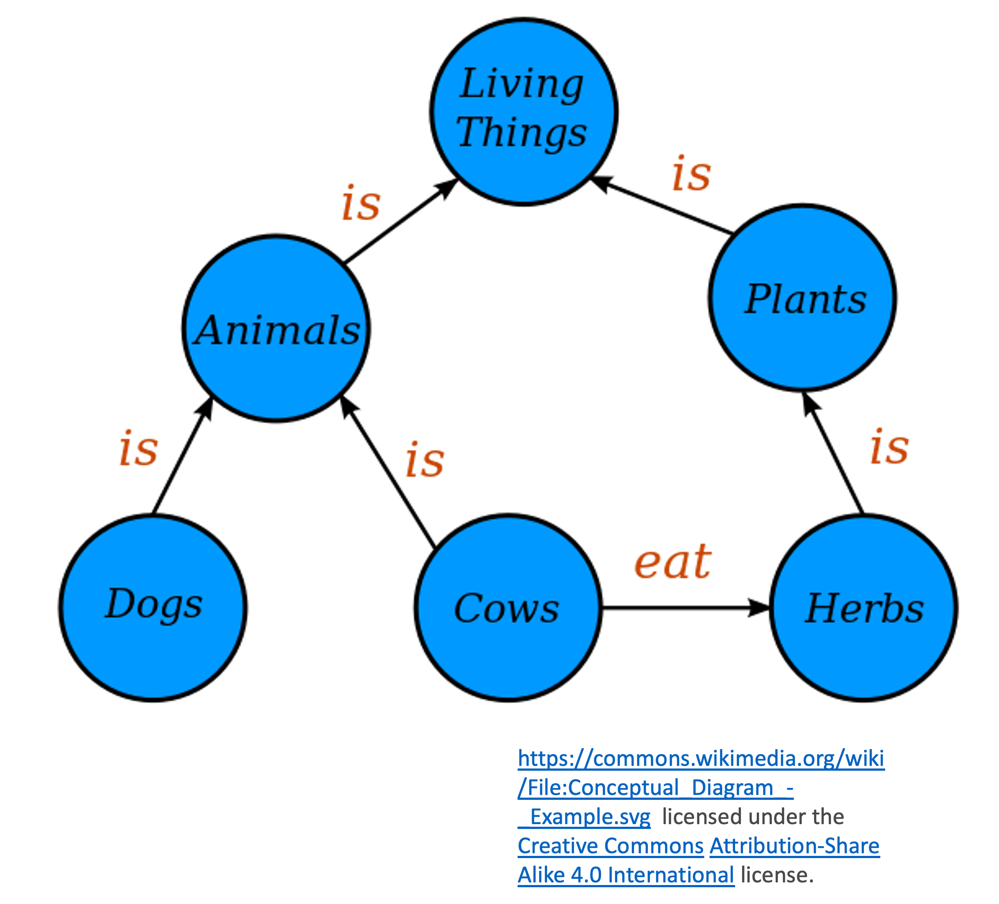

# Knowledge Graphs

Knowledge bases rooted in logic provide us with a powerful mechanism for representing and reasoning about our knowledge of the world. It provides us with theoretically sound and robust tools for querying our knowledge. They are readily and easily updated, are human-readable (at least in principle), and, importantly, provides us with mechanisms for deriving new knowledge using techniques such as forward chaining.

However, knowledge bases are not a panacea.

* They are difficult to construct, requiring extensive input from subject matter experts to ensure that the logical formulation really does correspond to the knowledge that is being encoded.
* They do not scale well, and there are no annotations to support interpretability.
* The constraint-based approach to programming is not terribly intuitive for most programmers who are used to imperative, object-oriented, or functional styles of programming.

These limitations make knowledge bases of limited use for large-scale applications. The scaling is the real bottleneck: it is simply not practical to build and maintain large scale systems represented in this way.

Systems based in first order logic do have some desirable properties:
* Explicit modelling of relationships between entities.
* The notion of "types": each variable has a domain in which it is valid (for a given predicate) and this permits a basic form of type checking.

Practical, scalable information retrieval systems benefit from having certain additional properties that can require some significant contortions to add to a logic-based knowledge base. These include:

* Annotation of entities with additional information.
* Scalability to large numbers of entities.
* Highly parallel querying.
* Online updating.
* Readable by machines.
* Interpretable by humans.

One type of system designed with these goals in mind is the **knowledge graph**. Consider the following rule-based system in first order logic:

1. $\mathrm{Student(Alice)}$
2. $\mathrm{Student(Bob)}$
3. $\mathrm{Student(Chen)}$
4. $\mathrm{Professor(Diana)}$
5. $\mathrm{Professor(Edward)}$
6. $\mathrm{Professor(Faye)}$
7. $\mathrm{Course(AI)}$
8. $\mathrm{Module(ECS8050)}$
9. $\mathrm{Module(ECS8051)}$
10. $\mathrm{Module(ECS8052)}$
11. $\mathrm{Enrolled(Alice,AI)}$
12. $\mathrm{Enrolled(Bob,AI)}$
13. $\mathrm{Enrolled(Chen,AI)}$
14. $\mathrm{Teaches(Diana,ECS8050)}$
15. $\mathrm{Teaches(Edward,ECS8051)}$
16. $\mathrm{Teaches(Faye,ECS8052)}$
17. $\mathrm{Requires(AI,ECS8050)}$
18. $\mathrm{Requires(AI,ECS8051)}$
19. $\mathrm{Requires(AI,ECS8052)}$
20. $\mathrm{Passed(Alice,ECS8050)}$
21. $\mathrm{Passed(Alice,ECS8051)}$
22. $\mathrm{Passed(Alice,ECS8052)}$
23. $\mathrm{Passed(Bob,ECS8050)}$
24. $\mathrm{Passed(Bob,ECS8052)}$
25. $\mathrm{Passed(Chen,ECS8050)}$
26. $\mathrm{Passed(Chen,ECS8051)}$
27. $\mathrm{Passed(Chen,ECS8052)}$

It is not difficult to see how this could be drawn as a network, or **graph**.

* Unary Predicates correspond to nodes in the graph
* Binary Predicates correspond to directed edges

This is an example of a **knowledge graph**.

## What is a Knowledge Graph?

A knowledge graph is a knowledge base structured as a graph. It is similar to the graphs we drew to represent rule-based systems but with some very important differences. The key features are:

* Nodes in the graph represent "things" (entities).
* Edges in the graph represent relationships between the entities.
* Nodes and Edges can have a *type* that specified the nature of the entity or relationship.
* Structure is governed by a "grammar" or *schema*/*ontology*.
* Nodes and Edges can have attributes (properties).
* The graph is properly normalised, with each entity and relationship represented only once.
* The graph is explicit and declarative, and has intrinsic meaning.
* Readable by both humans and machines.
* Scales efficiently, often to millions of nodes.

An example of a grammar for our example knowledge graph is shown below. 

We can see immediately how this models the relationships between different entities. This is an example of a *schema* or *ontology* that is used to specific a *grammar* for a graph but does not contain any actual facts. Instead, it simply shows what type of nodes are allowed and how they can be connected to each other. Designing the ontology is a crucial part of any knowledge graph. Here is another example of an ontology:

## Graphs vs Relational Databases

One justification for knowledge graphs is that they allow us to represent *relations* in data. We already have relational databases though, so what does the graphical formulation give us? Let us consider how we would represent this problem in a relational database. Typically we would have a table for each entity, with relations between entities encoded by cross-references to entities in other (or the same) table.

In a relational database we could represent academic staff using a table that would include their name, their staff ID, and a dedicated primary key.

|uid (PK)| staffID | name      |
|:-------|:--------|:----------|
| 1      |12345    |Iain Styles|
| 2      |54321    |Hui Wang   |
| 3      |12321    |Lu Bai     |

We would define modules in a similar way, with the notion of `taughtby` encoded via a reference to the primary key of the teacher in the staff table.

|mid (PK) |moduleID | name     | taughtBy |
|:--------|:--------|:--------------|:---------|
|11|45678    | Introduction to AI    | 3    |
|12|56789    | Machine Learning      | 2    |
|13|67890    | Knowledge Engineering | 1    |

This clearly represents the data, but it is hardly transparent. Information is spread across multiple tables, relationships are encoded but not in a direct way, normalisation has to be enforced, and it is not very human-readable when there are many records and tables.

Compare this to a graphical representation. Relationships are represented directly, it is naturally normalised and human-readable. Entities that are related to each other are close in the graph. The graph can, of course, be constructed from a properly structured (ie in Boyce-Codd normal form) relational database in which the data is properly normalised and relations correctly represented, but the database would need to be structured with that in mind to guarantee that this is possible.
