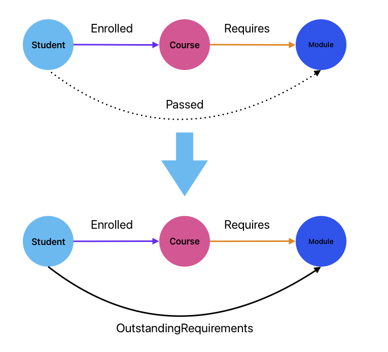

# Elementary Inference on Graphs

Consider our example of a simple knowledge graph.

We have previously showed how, in first order logic, we could infer new relations if we defined some inference rules. For example:

$$\mathrm{Student}(s) \land \mathrm{Module}(m) \land \exists c: [\mathrm{Course}(c)  \land \mathrm{Enrolled}(s,c) \land \mathrm{Requires}(c,m) \land \lnot\mathrm{Passed}(s,m) \implies \mathrm{OutstandingRequirements}(s,m]$$

This rule enables new relations to be created and thus new edges added to the graph. This is a relatively common operation in knowledge graphs which are rarely complete. One of the advantages of knowledge graphs over other forms of representation is that theThey often have entities added to them dynamically, along with some relations. However, when new information is combined with information already in the graph, relations can be inferred that were not present in either the original graph or the new information.

Graphwise, how do we interpret this rule? It says that if a student $s$ and a module $m$ are linked to a course $c$ by relations  `Enrolled` and `Requires` respectively, and if $s$ and $m$ are not linked by a `Passed` relation, then they should be linked by an `OutstandingRequirements` relation. Graphically we could depict this as shown below, where we explicit denote the missing relation with a dotted line to be clear that we should only apply this role when the relation is not present.

This amounts to a very simple form of [*graph rewriting*](https://en.wikipedia.org/wiki/Graph_rewriting), where a pattern in a graph ie replaced by a different pattern.